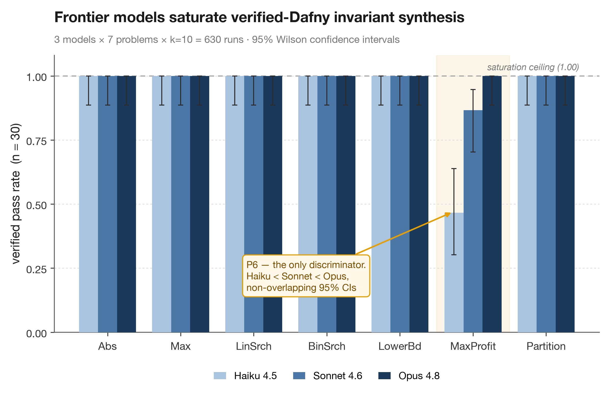
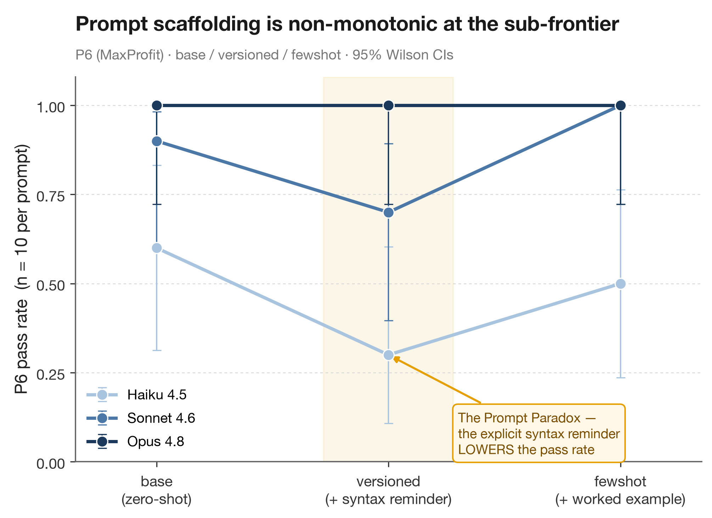
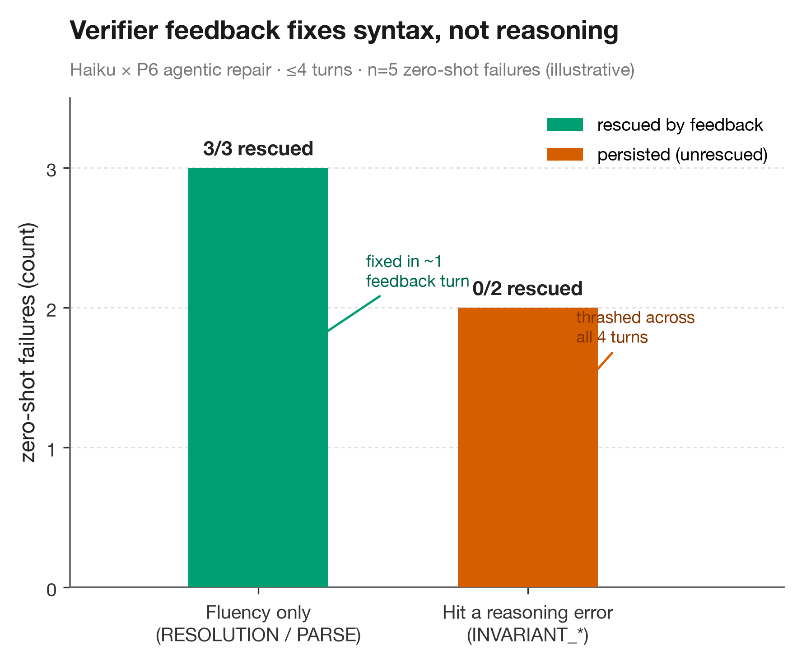

# dafny-eval

**Can frontier LLMs write *verifiable* code?**

A small, **soundness-hardened, contamination-controlled** benchmark that asks LLMs to restore
the proof annotations stripped from a verified Dafny method, runs the result through a real
verifier (`dafny verify` → Boogie → Z3), and scores it through a gate that cannot be fooled by
spec-weakening or syntactic mimicry.

`Dafny 4.11.0`  ·  `3 models × 7 problems × 3 prompts × k=10 = 630 verified runs`  ·  `95% Wilson confidence intervals`  ·  `stdlib-only harness`

---

## Abstract

> Frontier models **saturate** this suite: **Opus 4.8 went 210/210 (95% Wilson CI [0.98, 1.00])**.
> Six of seven problems are at 100% for *every* model and prompt. The lone discriminator is one
> novel problem (P6), and only for sub-frontier models. The true failure boundary lies in proofs
> too complex to cheaply author *references* for: the **Oracle Limit** (§5).

---

## Contents

1. [The Semantic-Integrity Architecture](#1-the-semantic-integrity-architecture)
2. [The Problem Suite](#2-the-problem-suite)
3. [Results: The CI-Backed Matrix](#3-results-the-ci-backed-matrix)
4. [The Prompt Paradox](#4-the-prompt-paradox)
5. [The Saturation Conclusion: The Oracle Limit](#5-the-saturation-conclusion-the-oracle-limit)
6. [Extensions: Compositional Gate and Agentic Self-Healing](#6-extensions-compositional-gate-and-agentic-self-healing)
7. [Failure Taxonomy](#7-failure-taxonomy)
8. [Reproducibility](#reproducibility) · [Repository Layout](#repository-layout) · [Limitations](#limitations) · [Prior Art](#prior-art)

---

## 1. The Semantic-Integrity Architecture

The task is **annotation-infill**: each `solutions/*.dfy` is a verified reference; we strip its
`invariant` / `decreases` / `assert` lines and ask the model to restore them. The scoring gate
runs **before** the verifier and, crucially, judges *mathematical soundness, not text*:

```
generate(text, stop_reason) → extract_dafny → score():

  1. TRUNCATED?   API stop_reason == max_tokens/length and output unusable
  2. UNSOUND?     denylist: assume · {:axiom} · {:verify false} · decreases * · assert false · {:extern}
  3. SEMANTIC INTEGRITY  ◄── the core defense
        body   = split_method(model_output)          # take ONLY the model's method body
        stitched = canonical_header + body            # re-impose OUR signature + requires + ensures
        run dafny verify(stitched) → classify
  4. classify the stitched verification
```

**Why stitching matters.** We *discard the model's spec and force our own*, then verify the
model's body+invariants against it. This closes two holes a naïve harness has, both demonstrated
during development:

| Attack | Naïve harness | This gate |
|---|---|---|
| `ensures true` + trivial body (spec-weakening) | scored **PASS** (verified its own weak spec) | `POSTCONDITION_FAIL`: our real `ensures` is re-imposed and the body can't meet it |
| `assume <postcondition>` (verifier escape hatch) | could pass | `UNSOUND` (denylist) |
| rename a loop variable `i`→`idx` (benign) | flagged **`SPEC_DRIFT`** (false negative!) | `FULL_SUCCESS`: semantics, not text |

The earlier *textual* integrity check flagged a perfectly correct, verifying solution as a failure
purely because a local variable was renamed. Semantic integrity fixes this: benign edits (renames,
reformatting) pass; spec-weakening is impossible to benefit from. `body_changed` is logged for
analytics but **never fails a run**. `guardtest` proves all four rows above hold.

Verification is **machine-independent**: a deterministic Z3 `--resource-limit` (not wall-time),
`--cores:1`, `RandomSeed=0`, and `dafny verify` run **without** `--allow-warnings` (so a stray
`assume` warning stays a hard error, a second line of defense). Per-proof `resource_count` is
logged per row. Toolchain pinned in [`versions.lock`](versions.lock); classifier strings calibrated
against ground-truth probes (`tests/calibration/`, checked by `make calibrate`).

---

## 2. The Problem Suite

| # | Problem | Tier | What it stresses |
|---|---|---|---|
| P1 | `Abs` | canonical | postcondition only |
| P2 | `Max` | canonical | one loop invariant + bounds |
| P3 | `LinearSearch` | canonical | ∀-prefix invariant |
| P4 | `BinarySearch` | canonical | invariant + `decreases` + off-by-one |
| P5 | `LowerBound` | **mutated** | boundary invariant (first index ≥ key) |
| P6 | `MaxProfit` | **novel** | single-pass running-best (min-so-far) invariant |
| P7 | `Partition` | **novel** | array mutation + framing + `multiset` preservation via swaps |

Canonical = the most-published verified-Dafny programs (contamination probes). Mutated/novel break
verbatim recall while preserving the algorithmic skill. (P6/P7 were chosen over Kadane / set-preserving
dedup, whose *reference* proofs collapse into SMT lemma-plumbing rather than invariant insight; see §5.)

---

## 3. Results: The CI-Backed Matrix



Aggregated over the three prompts (**n = 30** per cell), 95% **Wilson** intervals:

| Problem | Haiku 4.5 | Sonnet 4.6 | Opus 4.8 |
|---|:--:|:--:|:--:|
| P1 Abs | 1.00 [.89, 1.0] | 1.00 [.89, 1.0] | 1.00 [.89, 1.0] |
| P2 Max | 1.00 [.89, 1.0] | 1.00 [.89, 1.0] | 1.00 [.89, 1.0] |
| P3 LinearSearch | 1.00 [.89, 1.0] | 1.00 [.89, 1.0] | 1.00 [.89, 1.0] |
| P4 BinarySearch | 1.00 [.89, 1.0] | 1.00 [.89, 1.0] | 1.00 [.89, 1.0] |
| P5 LowerBound | 1.00 [.89, 1.0] | 1.00 [.89, 1.0] | 1.00 [.89, 1.0] |
| **P6 MaxProfit** | **0.47 [.30, .64]** | **0.87 [.70, .95]** | **1.00 [.89, 1.0]** |
| P7 Partition | 1.00 [.89, 1.0] | 1.00 [.89, 1.0] | 1.00 [.89, 1.0] |

**Overall: Opus 4.8 = 210/210 = 1.00 [0.98, 1.00].** At n=30 the **P6 gradient is statistically
separable**: Haiku [0.30, 0.64], Sonnet [0.70, 0.95], Opus [0.89, 1.00] have **non-overlapping**
intervals, so the model ordering on P6 is a defensible claim, not noise. Only **20 / 630** runs were
non-success, all on P6: 6× `INVARIANT_NOT_MAINTAINED`, 2× `INVARIANT_ENTRY_FAIL`, 8× `RESOLUTION_ERROR`,
2× `PARSE_ERROR`, 2× transient empty response. **Zero** `UNSOUND` / spec-drift across 630 runs; the
guards held and never false-flagged a correct body.

---

## 4. The Prompt Paradox



P6 is the only place the prompt mattered. We ran three system prompts to test whether the original
failures were a *true capability limit* or a *zero-shot fluency artifact*: **`base`** (control),
**`versioned`** (+ explicit Dafny-4.11 syntax: "use `forall`, not English; no built-in `min`"),
**`fewshot`** (+ a worked example).

| P6 MaxProfit (n=10/cell) | base | versioned | fewshot | failure modes |
|---|:--:|:--:|:--:|---|
| Haiku 4.5 | 0.60 [.31,.83] | **0.30 [.11,.60]** | 0.50 [.24,.76] | `RESOLUTION` + `INVARIANT_NOT_MAINTAINED` |
| Sonnet 4.6 | 0.90 [.60,.98] | **0.70 [.40,.89]** | 1.00 [.72,1.0] | `INVARIANT_ENTRY_FAIL` under `versioned` |
| Opus 4.8 | 1.00 [.72,1.0] | 1.00 [.72,1.0] | 1.00 [.72,1.0] | - |

**Verdict: not a pure fluency artifact.** No prompt rescues Haiku: its best cell is the zero-shot
`base` (0.60), and neither the syntax reminder nor the few-shot lifts it toward 1.0. The robust,
counterintuitive signal at n=10 is that the **`versioned` prompt, the explicit Dafny-syntax reminder,
*underperforms* for both sub-frontier models** (Haiku 0.30, Sonnet 0.70; each its model's worst), while
`fewshot` rescues Sonnet (→1.0) but not Haiku. Real `INVARIANT_NOT_MAINTAINED` / `INVARIANT_ENTRY_FAIL`
failures persist alongside the `RESOLUTION` ones, so a genuine reasoning limit sits beneath the surface
syntax errors, and *telling the model the syntax does not fix it*. A single-prompt eval would have
reported anywhere from 0.30 to 0.60 for the same Haiku×P6 cell.

**Honest caveat:** even at n=10 the per-*prompt* intervals overlap (Haiku `base` [.31,.83] vs `versioned`
[.11,.60]), so the prompt *ranking* stays suggestive, not significant. What doubling the sample firmed up
is the **aggregated model gradient on P6** (§3, non-overlapping at n=30): the defensible claims are
(a) Opus saturates P6; (b) **Haiku < Sonnet < Opus on P6 is now statistically separable**; (c) real
invariant-reasoning failures occur there. The per-prompt order remains point-estimate folklore.

---

## 5. The Saturation Conclusion: The Oracle Limit

With confidence intervals attached, **the frontier still saturates the suite**: every Opus cell and
six of seven problems for every model sit at 1.00 with a lower bound of 0.89 (0.98 for Opus overall, 210/210).
No amount of additional sampling changes a benchmark whose items are at the ceiling: the instrument
has run out of dynamic range for these models.

The natural fix, harder problems, runs into the **Oracle Limit**: the proofs hard enough to break
Opus/Sonnet (recursive-sum reasoning à la Kadane, set-preservation over mutated arrays) are exactly
the ones whose *reference* proofs we cannot author and verify cheaply. Both were attempted and
swapped out precisely because their verification collapsed into SMT lemma-plumbing rather than
invariant synthesis. **You cannot benchmark what you cannot first verify**, so a contamination-clean,
soundness-checked infill benchmark of this kind has a built-in ceiling at roughly the difficulty of a
clean single-loop proof. Pushing past it is a *reference-authoring* research problem, not a
sampling-or-prompting one.

What this benchmark **does** establish, defensibly: current frontier models reliably synthesize loop
invariants for single-loop algorithms (canonical *and* novel) under a cheat-proof, contamination-aware
gate; the residual failures are sub-frontier, concentrated on one problem, mixed fluency/reasoning, and
prompt-unstable. Compositional problems up to four interacting declarations (§6) saturate as well,
confirming the boundary is *proof difficulty*, not *declaration count*.

---

## 6. Extensions: Compositional Gate and Agentic Self-Healing

Two architecture upgrades (the highest-ROI items from `PIPELINE_AUDIT.md`), built and validated.

### 6.1 Multi-function (compositional) gate

The semantic-integrity gate now parses and stitches *every*
top-level declaration (function / predicate / method / lemma), not just one method, so problems
spanning multiple interacting contracts are representable. Single-method problems are the
1-declaration special case (P1–P7 unchanged); comment-stripping first also fixed the audit's
brace-in-comment bug. Compositional tier:

| Problem | decls | tests |
|---|:--:|---|
| P8 `ClampArray` | 2 | invariant must thread a helper function's postcondition |
| P10 `MakePositive` | 3 | maintain a `predicate`-defined invariant across the loop |
| P9 `Pipeline` | 4 | align `requires`/`ensures` across nested calls; compose 3 function semantics |

All references verify; each piece is individually trivial (so authoring escapes the Oracle Limit):
the difficulty is the cross-declaration alignment. **Result (zero-shot, k=10): every model solves
P8, P9, *and* P10 at 10/10**: 60/60 across the two deeper problems (all three models, 1.00 [0.72, 1.00]).
The 4-declaration nested-contract pipeline (P9) induced **no** context collapse, even for Haiku:
*more functions is not harder for the frontier.* This is the clean confirmation of the Oracle Limit:
the discriminating axis is **proof difficulty, not declaration count.** (Repair on P9/P10: nothing to
rescue, zero-shot was already saturated.)

### 6.2 Agentic self-healing (verifier-feedback repair)

A multi-turn loop feeds Dafny's actual error
back and asks for a fix (≤N turns). Repair matrix (P6+P8 × 3 models × 10 trajectories, ≤4 turns):

| cell | zero-shot | after repair | rescued (of 0-shot fails) | turns→converge |
|---|:--:|:--:|:--:|:--:|
| **Haiku × P6** | 5/10 | **8/10** | **3/5** | 2.0 |
| Sonnet/Opus × P6, all × P8 | 10/10 | 10/10 | - | - |



**Finding: feedback rescues *fluency*, not *reasoning*.** The only failing cell was Haiku × P6, and
the loop split it down the taxonomy: **all 3 rescued failures were `RESOLUTION_ERROR`** (hallucinated
builtin / syntax), fixed in one feedback turn; the **2 unrescued failures were
`INVARIANT_NOT_MAINTAINED`**, where the model thrashed across all 4 turns and never converged. Verifier
feedback closes the syntax gap immediately but not the reasoning gap. (n=5 failures → the 3/5 rate is
directional; the category split is the robust result.)

---

## 7. Failure Taxonomy

`FULL_SUCCESS` · `PARSE_ERROR` · `RESOLUTION_ERROR` · `WELLFORMEDNESS_BOUNDS` (array bounds / subset /
div-by-zero) · `PRECONDITION_FAIL` · `POSTCONDITION_FAIL` · `INVARIANT_ENTRY_FAIL` ·
**`INVARIANT_NOT_MAINTAINED`** · `TERMINATION_FAIL` · `ASSERTION_FAIL` · `OTHER_VERIFICATION_FAIL` ·
`TIMEOUT` · `UNSOUND` · `TRUNCATED`. Classification is on Dafny **stdout** (exit codes are unspecified).

---

## Reproducibility

```bash
brew install dafny                 # macOS / arm64; toolchain pinned in versions.lock
make demo                          # calibrate + selftest + guardtest, no API key needed
# full matrix (needs ANTHROPIC_API_KEY):
python3 dafny_eval.py run \
  --models anthropic:claude-haiku-4-5 anthropic:claude-sonnet-4-6 anthropic:claude-opus-4-8 \
  --prompts base versioned fewshot --k 10 --no-thinking --out results/results_master.jsonl
python3 dafny_eval.py report results/results_master.jsonl
```

Stdlib-only harness. Model specs: `oracle · anthropic:M · openai:M · deepseek:M · vllm:M@URL`.
Raw per-run data (completions, categories, resource counts): `results/results_master.jsonl`.

---

## Repository Layout

```
dafny_eval.py            stdlib-only harness: generate → stitch → verify → classify → report
solutions/               10 verified Dafny references (P1–P10); the infill ground truth
tests/calibration/       classifier-calibration probes (checked by `make calibrate`)
results/                 raw per-run JSONL (results_master.jsonl = the 630-run matrix)
charts/make_figures.py   regenerates figures/*.png at 300 dpi from results/
figures/                 fig1 capability matrix · fig2 prompt paradox · fig3 repair dichotomy
versions.lock            pinned toolchain (Dafny / Z3) for machine-independent verification
PIPELINE_AUDIT.md        architectural audit + ROI-ranked extension backlog
DAFNY_EVAL_SPEC.md       original design specification
Makefile                 `make demo` = calibrate + selftest + guardtest (no API key)
```

---

## Limitations

- **k = 10 (n=30 per problem, n=10 per prompt-cell)** → aggregated model gradients on P6 are
  statistically separable; per-*prompt* rankings still overlap and remain suggestive. Saturation = 0
  observed failures with the stated lower bound (≥0.89), not a proof of ≥99%.
- **Task is infill** (full body + spec given), the easiest formulation; not spec→implementation synthesis.
- **Contamination is controlled, not measured**: novelty tiers are an argument (verified-Dafny corpora
  are tiny), not a recall probe.
- **No-thinking, near-deterministic** sampling → k measures consistency more than spread.
- **One verifier / one Z3 version** (pinned); results are Dafny-4.11-scoped.

---

## Prior Art

DafnyBench (Loughridge et al.) · Clover (arXiv:2310.17807) · DafnyPro (arXiv:2601.05385).
